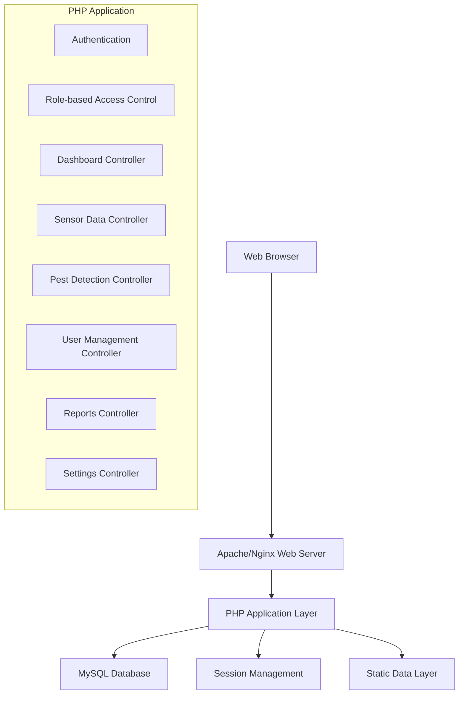

# Design Document

## Overview

The IoT-Enabled Farm Monitoring System is a web-based application built using PHP, MySQL, HTML, CSS (Bootstrap), and JavaScript. The system follows a traditional MVC-like architecture with separate pages for different functionalities, session-based authentication, and role-based access control. The application will extend the existing dashboard framework to provide farm-specific monitoring capabilities with static sample data for demonstration purposes.

## Architecture

### System Architecture



### Technology Stack

- **Frontend**: HTML5, CSS3, Bootstrap 5.1.3, JavaScript, Font Awesome icons
- **Backend**: PHP 7.4+
- **Database**: MySQL 8.0+
- **Session Management**: PHP Sessions
- **Charts/Visualization**: Chart.js for data visualization
- **Authentication**: Session-based with password hashing

## Components and Interfaces

### 1. Authentication System

**Purpose**: Handle user login, logout, and session management with role-based access control.

**Components**:
- `login.php` - Authentication logic
- `logout.php` - Session termination
- `config.php` - Database connection and session initialization

**Interface**:
```php
class AuthManager {
    public function authenticate($username, $password): bool
    public function logout(): void
    public function isLoggedIn(): bool
    public function getUserRole(): string
    public function hasPermission($page): bool
}
```

### 2. Navigation System

**Purpose**: Provide role-based navigation with consistent UI across all pages.

**Components**:
- Shared navigation component included in all pages
- Role-based menu rendering
- Active page highlighting

**Interface**:
```php
class NavigationRenderer {
    public function renderNavigation($currentPage, $userRole): string
    public function getMenuItems($userRole): array
    public function isPageAccessible($page, $userRole): bool
}
```

### 3. Dashboard Module

**Purpose**: Display farm overview with sensor summaries and pest alerts.

**Components**:
- `dashboard.php` - Main dashboard page
- Summary cards for sensor readings
- Pest alert panel
- Quick statistics display

**Data Structure**:
```php
class DashboardData {
    public function getCurrentSensorReadings(): array
    public function getRecentPestAlerts(): array
    public function getDailyStatistics(): array
    public function getChartData(): array
}
```

### 4. Sensor Management Module

**Purpose**: Display and manage sensor data with visualization.

**Components**:
- `sensors.php` - Sensor overview page
- Sensor data table
- Chart visualization components
- Status indicators

**Data Structure**:
```php
class SensorData {
    public $sensorId;
    public $sensorType; // temperature, humidity, soil_moisture
    public $currentValue;
    public $unit;
    public $status; // online, offline
    public $lastReading;
    public $location;
}
```

### 5. Pest Detection Module

**Purpose**: Manage pest alerts and detection information.

**Components**:
- `pest_detection.php` - Pest alerts page
- Alert table with filtering
- Notification panel
- Pest detail views

**Data Structure**:
```php
class PestAlert {
    public $alertId;
    public $pestType;
    public $location;
    public $severity; // low, medium, high, critical
    public $timestamp;
    public $status; // new, acknowledged, resolved
    public $description;
    public $suggestedActions;
}
```

### 6. User Management Module (Admin Only)

**Purpose**: Manage user accounts and permissions.

**Components**:
- `user_management.php` - User administration page
- User CRUD operations
- Role assignment interface

**Data Structure**:
```php
class User {
    public $userId;
    public $username;
    public $email;
    public $role; // admin, student, farmer
    public $status; // active, inactive
    public $createdAt;
    public $lastLogin;
}
```

### 7. Reports Module

**Purpose**: Generate and display farm data reports.

**Components**:
- `reports.php` - Reports dashboard
- Report generation logic
- Export functionality (CSV/PDF)

**Interface**:
```php
class ReportGenerator {
    public function generateSensorReport($dateRange): array
    public function generatePestReport($dateRange): array
    public function exportToCSV($data, $filename): void
    public function exportToPDF($data, $filename): void
}
```

### 8. Settings Module

**Purpose**: Manage application and user preferences.

**Components**:
- `settings.php` - Settings configuration page
- Theme management
- Notification preferences
- System configuration placeholders

### 9. Profile Module

**Purpose**: User account management and profile updates.

**Components**:
- `profile.php` - User profile page
- Password change functionality
- Profile information updates

## Data Models

### Database Schema Extensions

```sql
-- Extend existing users table
ALTER TABLE users ADD COLUMN email VARCHAR(100);
ALTER TABLE users ADD COLUMN role ENUM('admin', 'student', 'farmer') DEFAULT 'student';
ALTER TABLE users ADD COLUMN status ENUM('active', 'inactive') DEFAULT 'active';
ALTER TABLE users ADD COLUMN last_login TIMESTAMP NULL;

-- Sensor data table (static sample data)
CREATE TABLE sensors (
    id INT AUTO_INCREMENT PRIMARY KEY,
    sensor_name VARCHAR(100) NOT NULL,
    sensor_type ENUM('temperature', 'humidity', 'soil_moisture') NOT NULL,
    location VARCHAR(100) NOT NULL,
    status ENUM('online', 'offline') DEFAULT 'online',
    created_at TIMESTAMP DEFAULT CURRENT_TIMESTAMP
);

-- Sensor readings table (static sample data)
CREATE TABLE sensor_readings (
    id INT AUTO_INCREMENT PRIMARY KEY,
    sensor_id INT,
    value DECIMAL(10,2) NOT NULL,
    unit VARCHAR(20) NOT NULL,
    recorded_at TIMESTAMP DEFAULT CURRENT_TIMESTAMP,
    FOREIGN KEY (sensor_id) REFERENCES sensors(id)
);

-- Pest alerts table (static sample data)
CREATE TABLE pest_alerts (
    id INT AUTO_INCREMENT PRIMARY KEY,
    pest_type VARCHAR(100) NOT NULL,
    location VARCHAR(100) NOT NULL,
    severity ENUM('low', 'medium', 'high', 'critical') NOT NULL,
    status ENUM('new', 'acknowledged', 'resolved') DEFAULT 'new',
    description TEXT,
    suggested_actions TEXT,
    detected_at TIMESTAMP DEFAULT CURRENT_TIMESTAMP
);

-- User settings table
CREATE TABLE user_settings (
    id INT AUTO_INCREMENT PRIMARY KEY,
    user_id INT,
    setting_key VARCHAR(100) NOT NULL,
    setting_value TEXT,
    FOREIGN KEY (user_id) REFERENCES users(id),
    UNIQUE KEY unique_user_setting (user_id, setting_key)
);
```

### Static Sample Data Structure

**Sensor Sample Data**:
- Temperature sensors: 18°C - 35°C range
- Humidity sensors: 40% - 85% range  
- Soil moisture sensors: 20% - 80% range
- Mix of online/offline status for demonstration

**Pest Alert Sample Data**:
- Common farm pests: aphids, caterpillars, beetles, fungal infections
- Various severity levels and locations
- Different status states for workflow demonstration

## Error Handling

### Error Categories

1. **Authentication Errors**
   - Invalid credentials
   - Session timeout
   - Unauthorized access attempts

2. **Database Errors**
   - Connection failures
   - Query execution errors
   - Data validation failures

3. **Application Errors**
   - Missing required parameters
   - Invalid data formats
   - File operation failures

### Error Handling Strategy

```php
class ErrorHandler {
    public function handleDatabaseError($exception): void
    public function handleAuthenticationError($errorType): void
    public function handleValidationError($errors): void
    public function logError($error, $context): void
    public function displayUserFriendlyError($errorType): string
}
```

### Error Display

- Use Bootstrap alert components for user-facing errors
- Implement toast notifications for non-critical alerts
- Log detailed errors to server logs for debugging
- Provide graceful fallbacks for missing data

## Testing Strategy

### Unit Testing

**Components to Test**:
- Authentication functions
- Data validation methods
- Report generation logic
- Role-based access control

**Testing Framework**: PHPUnit

### Integration Testing

**Test Scenarios**:
- User login/logout flow
- Role-based page access
- Data retrieval and display
- Form submissions and validations

### User Acceptance Testing

**Test Cases**:
- Admin user workflow (all pages accessible)
- Student/Farmer user workflow (limited access)
- Dashboard data display accuracy
- Navigation functionality
- Responsive design on different devices

### Sample Data Testing

**Verification Points**:
- Sensor data displays correctly in charts
- Pest alerts show appropriate severity indicators
- Reports generate with sample data
- Export functionality works with static data

## Security Considerations

### Authentication Security

- Password hashing using PHP's `password_hash()`
- Session management with secure settings
- CSRF protection for forms
- Input validation and sanitization

### Access Control

- Role-based page access verification
- SQL injection prevention using prepared statements
- XSS prevention through proper output escaping
- File upload restrictions (if implemented)

### Data Protection

- Sensitive data encryption in database
- Secure session configuration
- HTTPS enforcement (production)
- Regular security updates

## Performance Considerations

### Database Optimization

- Proper indexing on frequently queried columns
- Efficient query design for large datasets
- Connection pooling for high traffic
- Caching strategies for static sample data

### Frontend Optimization

- Minified CSS and JavaScript files
- Optimized image assets
- Lazy loading for charts and large datasets
- CDN usage for external libraries

### Scalability Preparation

- Modular code structure for easy extension
- Separation of concerns for maintainability
- API-ready architecture for future IoT integration
- Database schema designed for real sensor data migration